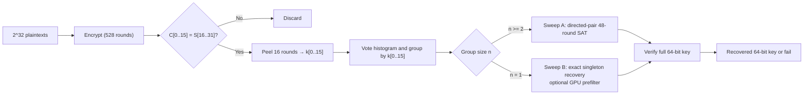
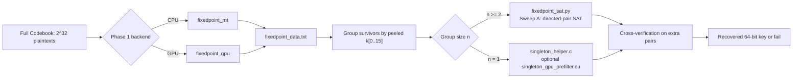

# Fixed-Point Attack on KeeLoq

A key recovery attack on full 528 round KeeLoq that uses fixed points of the round function.

## Overview

KeeLoq uses a 64 bit key, a 32 bit block, and 528 encryption rounds. The key schedule has period 64, so $E_{528} = E_{16} \circ (E_{64})^8$. If a plaintext $S$ is a fixed point of $(E_{64})^8$, then $E_{528}(K, S) = E_{16}(K, S)$. This lets us split key recovery into two phases:

- **Phase 1 (C/CUDA):** Scan all $2^{32}$ plaintexts, filter candidates with a 16 bit condition on the ciphertext, and peel 16 rounds to recover the lower 16 key bits $k[0..15]$ by majority vote. This runs on CPU or GPU.
- **Phase 2 (Python + helpers):** Recover the remaining 48 key bits with exhaustive directed pair SAT for groups with $n \geq 2$ and exact singleton recovery for groups with $n = 1$.

## Requirements

### System

- C compiler with C11 support (GCC or Clang)
- POSIX threads (pthreads)
- Python 3.8+
- Make

### Ubuntu / Server Setup

For fresh Ubuntu servers (e.g. Google Cloud), install build tools first:

```bash
sudo apt update
sudo apt install -y build-essential python3-pip python3-venv
```

### Python Packages

```bash
python3 -m venv venv
source venv/bin/activate
pip install python-sat
```

The Makefile auto-detects `venv/bin/python` if present. Override with `VENV=myenv`.

Optionally install CryptoMiniSat as an alternative solver:

```bash
pip install pycryptosat
```

## Quick Start

Run the full attack on CPU:

```bash
make attack KEY=0x5CEC6701B79FD949 THREADS=56
```

Run the mixed GPU Phase 1 + CPU Phase 2 path:

```bash
make attack KEY=0x5CEC6701B79FD949 PHASE1_BACKEND=gpu PHASE1_THREADS=512 PHASE2_THREADS=56
```

Run the end-to-end benchmark:

```bash
make benchmark THREADS=256 BENCH_KEYS=100 BENCH_SEED=42 BENCH_PHASE1_BACKEND=gpu BENCH_PHASE1_THREADS=256 BENCH_PHASE2_THREADS=256
```

Run the Phase 1-only GPU benchmark:

```bash
/usr/bin/time -p make benchmark THREADS=256 BENCH_KEYS=100 BENCH_SEED=42 BENCH_PHASE1_ONLY=1 BENCH_PHASE1_BACKEND=gpu
```

## KeeLoq Cipher

KeeLoq is a lightweight block cipher with a 64-bit key and 32-bit block. The round function combines five shift-register taps through a nonlinear function (NLF) and XORs the result with one key bit.

<p align="center">
  
</p>

The cipher runs 528 rounds for encryption. Since the key schedule has period 64, the 528-round encryption decomposes as $E_{528} = E_{16} \circ (E_{64})^8$, which enables the fixed-point attack.

## Cycle Terminology

We classify fixed points of $(E_{64})^8$ by their cycle structure under $E_{64}$:

- A **1-cycle** (or fixed point of $E_{64}$) is an $S$ such that $E_{64}(K, S) = S$.
- A **2-cycle** is a pair $(S_i, S_j)$ where $E_{64}(K, S_i) = S_j$ and $E_{64}(K, S_j) = S_i$. Both elements are fixed points of $(E_{64})^2$ and hence of $(E_{64})^8$.
- A **4-cycle** consists of four elements $S_0 \to S_1 \to S_2 \to S_3 \to S_0$ under $E_{64}$. All four are fixed points of $(E_{64})^4$ and $(E_{64})^8$.
- An **8-cycle** consists of eight elements forming a cycle of length 8 under $E_{64}$. All eight are fixed points of $(E_{64})^8$.

Any fixed point of $(E_{64})^8$ must belong to a 1-cycle, 2-cycle, 4-cycle, or 8-cycle of $E_{64}$.

## Notation

| Symbol | Meaning |
|--------|---------|
| $S$ | 32-bit plaintext (state) |
| $C$ | 32-bit ciphertext after 528 rounds: $C = E_{528}(K, S)$ |
| $M_{16}$ | State after 16 rounds: $M_{16} = E_{16}(k[0..15], S)$ |
| $k[0..15]$ (or $k_{16}$) | Lower 16 bits of the 64-bit key |
| $k[16..63]$ | Upper 48 bits of the 64-bit key |
| `votes_true` | Number of Phase 1 votes received by the true $k_{16}$ |
| `votes_best` | Highest vote count across all $k_{16}$ bins |
| `phase1_ok` | Whether the true $k_{16}$ is ranked #1 after Phase 1 |
| `phase2_ok` | Whether Phase 2 recovered the correct full key |

## Theoretical Foundation

> **Heuristic assumption.** The analysis below models $E_{64}$ as a uniform random permutation on $2^{32}$ elements. This is standard in cryptanalysis. It is not a proven property of KeeLoq. The benchmarks below match the main predictions of this model.

Model $(E_{64})^8$ as a random permutation on $2^{32}$ elements. Its fixed points are exactly the elements in 1-cycles, 2-cycles, 4-cycles, and 8-cycles of $E_{64}$. Random permutation theory says that the number of $d$-cycles is about $\operatorname{Poisson}(1/d)$ for $d \ll N$, and each $d$-cycle contributes $d$ fixed points. So the total number of true fixed points is:

$$\text{FP}_{\text{true}} = 1 \cdot \operatorname{Poi}(1) + 2 \cdot \operatorname{Poi}(\tfrac{1}{2}) + 4 \cdot \operatorname{Poi}(\tfrac{1}{4}) + 8 \cdot \operatorname{Poi}(\tfrac{1}{8})$$

Under this model, the four terms are asymptotically independent. Each term $d \cdot \operatorname{Poi}(1/d)$ has mean 1 and variance $d$. Summing gives:

$$\mathbb{E}[\text{FP}_{\text{true}}] = 1 + 1 + 1 + 1 = 4$$

$$\operatorname{Var}[\text{FP}_{\text{true}}] = 1 + 2 + 4 + 8 = 15$$

This is much more spread out than $\operatorname{Poisson}(4)$, which has variance 4. The main reason is the 8-cycle term: one 8-cycle adds 8 fixed points at once, so the right tail is much heavier.

To get **zero** true fixed points, all four cycle types must be absent at once:

$$P(\text{FP}_{\text{true}} = 0) = e^{-1} \cdot e^{-1/2} \cdot e^{-1/4} \cdot e^{-1/8} = e^{-15/8} \approx 15.3\%$$

So the expected **Phase 1 presence rate** is $1 - e^{-15/8} \approx 84.7\%$, where `votes_true > 0` means at least one true fixed point was found.

## Attack Outline



## Phase 1: Fixed-Point Scan

Phase 1 scans all $2^{32}$ plaintexts to find fixed point candidates and recover the lower 16 key bits.

### Scan, Filter, Peel, Vote

For each plaintext $S \in \{0, \ldots, 2^{32} - 1\}$:

1. Compute $C = E_{528}(K, S)$.
2. **Filter:** Check if $C[0..15] = S[16..31]$. This holds for all true fixed points and passes with probability $2^{-16}$ for random pairs, giving about $2^{16}$ false positives.
3. **Peel:** From each survivor $(S, C)$, recover a candidate for $k[0..15]$ by simulating 16 rounds and solving for each key bit. See details below.
4. **Vote:** Count how many survivors produce each $k[0..15]$ value.

### How Peeling Works

In KeeLoq encryption, each round computes a feedback bit:

$$\text{fb} = \text{NLF}(s_{31}, s_{26}, s_{20}, s_9, s_1) \oplus k_i \oplus s_{16} \oplus s_0$$

where $s$ is the current 32-bit state and $k_i$ is key bit $i \bmod 64$. The state then shifts right by one, and $\text{fb}$ enters at position 31.

After 16 rounds starting from $S$:
- Bits $C[0..15]$ come from $S[16..31]$ (shifted down). This is what the filter checks.
- Bits $C[16..31]$ are the 16 feedback bits from rounds 0 to 15: $C[16] = \text{fb}_0$, $C[17] = \text{fb}_1$, ..., $C[31] = \text{fb}_{15}$.

Since we know both $S$ and $C$, we can recover each key bit by rearranging the round equation:

$$k_i = C[16+i] \oplus \text{NLF}(s) \oplus s_{16} \oplus s_0$$

The algorithm is:

```
state = S
for i = 0 to 15:
    nlf = NLF(state[31], state[26], state[20], state[9], state[1])
    fb  = C[16 + i]                           # known from the ciphertext
    k[i] = fb ⊕ nlf ⊕ state[16] ⊕ state[0]   # solve for key bit
    state = (state >> 1) | (fb << 31)         # advance to next round
```

This recovers the 16-bit candidate $k[0..15]$ using only XOR operations, without brute force.

### How Voting Works

After peeling, we have about $2^{16}$ survivors, each with a peeled 16-bit value. The voting step counts how many survivors produce each possible $k[0..15]$ value.

**Implementation:** We maintain a histogram (array of $2^{16}$ counters). For each survivor with peeled value $v$, increment `histogram[v]`. After processing all survivors, sort the histogram entries by count (descending).

**Why voting works:**

- **True fixed points** (usually 2 to 8): All come from the same key. Peeling 16 rounds from any true fixed point gives the same correct $k[0..15]$, so all of them vote for one bin.

- **False positives** (about $2^{16}$): These pass the filter $C[0..15] = S[16..31]$ by chance, but they are not true fixed points. Their peeled "key bits" are effectively random, so each one votes for a random bin.

**The competition:** About $2^{16}$ false positives spread across $2^{16}$ bins, so the expected count per bin is about 1, following $\operatorname{Poisson}(1)$. The largest false bin usually gets 7 to 9 votes.

If the true $k[0..15]$ receives $\geq 8$ votes (from true fixed points), it wins rank #1. If it receives fewer votes (e.g., only 2 true fixed points), it may be buried below false-positive bins with higher counts.

**Output:** Phase 1 outputs **all** $k[0..15]$ candidates, sorted by vote count, not just the top one. This lets Phase 2 find the true group even when it is not ranked #1. Each candidate value becomes a group, and the survivors with that peeled value become that group's members.

### Rank Distribution: Why Top-1 Is Hard

The false-positive survivors each peel to a random $k_{16}$ value, so the false vote counts across the $2^{16}$ bins follow $\operatorname{Poisson}(1)$. The number of false bins with $\geq k$ votes is:

| Votes $\geq k$ | $P(\operatorname{Poi}(1) \geq k)$ | Expected false bins (out of $2^{16}$) | Implied rank of true $k_{16}$ if it has exactly $k$ votes |
|:-:|:-:|:-:|:-:|
| 5 | 0.00366 | $\sim 240$ | $\sim 240$ |
| 6 | 0.000594 | $\sim 39$ | $\sim 40$ |
| 7 | 0.0000841 | $\sim 5.5$ | $\sim 6$ |
| 8 | 0.0000103 | $\sim 0.67$ | $\sim 1$ to $2$ |
| 9+ | 0.0000011 | $\sim 0.07$ | #1 |

So the true $k_{16}$ usually needs about 8 to 9 votes to reach rank #1. Getting 8 or more true votes usually requires an 8-cycle of $E_{64}$, which has probability $1 - e^{-1/8} \approx 11.8\%$, plus help from shorter cycles. This matches the observed top-1 rate of about 20%.

Similarly, rank $\leq 10$ needs $\geq 7$ votes, rank $\leq 100$ needs $\geq 6$, and rank $\leq 1{,}000$ needs $\geq 5$. The observed rates, 28%, 35%, and 53%, are consistent with those thresholds.

## GPU Parallelism (Phase 1)

Phase 1 must encrypt every 32-bit plaintext, about $2^{32} \approx 4.3$ billion values, and check each one for the fixed-point condition. Each encryption is independent, so the scan maps well to a GPU.

### How the Work Is Split

A CUDA GPU organises work in three levels:

| Level | What it is | Our mapping |
|-------|-----------|-------------|
| **Thread** | The smallest unit of execution. Each thread runs the same code on different data. | **1 thread = 1 plaintext.** Thread $i$ encrypts plaintext $i$ through all 528 rounds and checks the filter condition. |
| **Block** | A group of threads that run together on one streaming multiprocessor (SM). Threads in a block can share fast local memory and synchronise with each other. | A block contains `threads_per_block` threads (default 256). In our kernel, threads are independent, so we only use block-level grouping for hardware scheduling. |
| **Grid** | The collection of all blocks for one kernel launch. The GPU distributes blocks across all available SMs. | The grid has $\lceil \text{chunk\_size} / \text{threads\_per\_block} \rceil$ blocks. With a chunk of $2^{26}$ plaintexts and 256 threads per block, the grid is $2^{26}/256 = 262{,}144$ blocks. |

We do not launch all $2^{32}$ threads at once. The GPU has block-count limits, and very long kernels can trigger watchdog timeouts. Instead, the code uses chunks of $2^{26}$, about 67 million, plaintexts. That gives $2^{32} / 2^{26} = 64$ kernel launches. Between launches, the code copies the small survivor set back to the host and prints progress. This chunking is an implementation choice, not a cryptanalytic requirement.

### What Each Thread Does

```
thread i:
    1. pt = start + i                      // my plaintext
    2. ct = KeeLoq_528(key, pt)            // full 528-round encryption
    3. if ct[0..15] == pt[16..31]:          // fixed-point filter
         k16 = peel_16_rounds(pt, ct)      // recover candidate k[0..15]
         atomically append (pt, ct, k16) to the survivors list
```

Step 3 fires for roughly 1 in $2^{16}$ plaintexts, so the atomic append is extremely rare and causes no contention.

### After the GPU Finishes

All survivors ($\sim 2^{16}$ of them) are copied back to the CPU, where a simple histogram vote over the `k16` values determines the best candidate. This host-side step is trivial compared to the scan.

### CLI Parameters

```
./fixedpoint_gpu [threads_per_block] [key_hex]
```

| Parameter | Default | Meaning |
|-----------|---------|---------|
| `threads_per_block` | 256 | Number of threads per block. Must be a multiple of 32 (warp size). Values between 128 and 512 are typical. Higher values give the GPU scheduler more flexibility; lower values use fewer registers per block, potentially allowing more blocks to run simultaneously. On an H100, try 256 or 512 and keep whichever is faster. |
| `key_hex` | `0x5CEC6701B79FD949` | The 64-bit target key in hex. In benchmark mode, the driver generates random keys and passes them here automatically. |

### Typical Numbers on an H100

| Metric | Value |
|--------|-------|
| Total plaintexts | $2^{32} = 4{,}294{,}967{,}296$ |
| Chunk size | $2^{26} = 67{,}108{,}864$ |
| Kernel launches | 64 |
| Threads per block | 256 to 512 |
| Blocks per launch | $\sim 262{,}144$ |
| Survivors (total) | $\sim 65{,}536$ |
| Scan time | A few seconds |

## Phase 2: Exact Recovery of $k[16..63]$

With $k[0..15]$ known, compute $M_{16} = E_{16}(k[0..15], S)$ for each candidate survivor. Phase 2 then recovers the remaining 48 key bits exactly. The implementation has two exhaustive sweeps:

- **Sweep A (`n >= 2`)**: exhaustive directed-pair 48-round SAT.
- **Sweep B (`n = 1`)**: exhaustive singleton constructive recovery, optionally accelerated by an exact GPU prefilter.

So Phase 2 does not rely on heuristic singleton budgets or fallback search passes. If a true Phase 1 group exists, Phase 2 will find the key.

### SAT Constraints by Cycle Type

- For a **1-cycle** fixed point ($E_{64}(K, S) = S$): $E_{48}(k[16..63], M_{16}) = S$.
- For a **2-cycle** pair ($E_{64}(K, S_i) = S_j$ and vice versa): $E_{48}(k[16..63], M_{16,i}) = S_j$.
- For **4/8-cycle** elements: general directed mapping constraints.

### Why Two Constraints Typically Determine the Key

Each constraint $E_{48}(k[16..63], M_{16}) = S$ gives 32 bit equations because the 32-bit output must match $S$. But we still have 48 unknown key bits. So one constraint is underdetermined and leaves about $2^{48-32} = 2^{16}$ solutions.

With **two independent constraints** from different fixed points, we get 64 bit equations on 48 unknowns. Under the random-function heuristic, the expected number of spurious solutions is about $2^{48-64} = 2^{-16}$, so the system usually has a unique solution. The SAT solver then finds it efficiently.

### Solver Structure

Phase 2 groups all survivors by their peeled $k[0..15]$ value and processes those groups in descending vote order.

### Sweep A: Directed-Pair SAT for Groups with $n \geq 2$

For each group with at least two candidates, Phase 2 fixes source indices 0 and 1 and tries every directed target pair:

$$
E_{48}(k[16..63], M_{16,0}) = S_b,
\qquad
E_{48}(k[16..63], M_{16,1}) = S_d,
$$

for all $b,d \in \{0,\dots,n-1\}$. This exhaustive $n^2$ sweep covers 1-cycles, 2-cycles, 4-cycles, and 8-cycles uniformly.

- If the group is false, all instances are UNSAT.
- If the group is the true one and $n \geq 2$, the correct successor pair is guaranteed to appear, so recovery is certain.

### Sweep B: Exact Singleton Recovery for Groups with $n = 1$

If Sweep A finds nothing, the true group must be a singleton. In that case the group corresponds to a 1-cycle and satisfies

$$
E_{48}(k[16..63], M_{16}) = S.
$$

A single 48-round constraint leaves exactly $2^{16}$ residual solutions. Instead of enumerating SAT models, the implementation reconstructs these $2^{16}$ candidates directly by guessing the first 16 feedback bits and deriving the remaining 48 key bits along the round recurrence. Each reconstructed key is then checked against cross-verification pairs.

This singleton path is exhaustive, but much faster than SAT model enumeration.

### Exact GPU Prefilter for Singletons

The implementation optionally accelerates Sweep B with a CUDA helper:

- it exhaustively scans every `(singleton group, prefix16)` pair on the GPU,
- rejects candidates against the first two extra verification pairs,
- and sends only the tiny survivor set back to the CPU for full verification.

This does **not** change the search space, so it does **not** reduce success probability. It is only a batching optimization for the singleton path.

### Why Phase 2 Is Exact

The implementation is exhaustive in both cases:

- **If the true group has $n \geq 2$**, Sweep A enumerates every directed successor pair and therefore must hit the correct one.
- **If the true group has $n = 1$**, Sweep B enumerates all $2^{16}$ singleton completions and therefore must hit the correct one.

So once `votes_true > 0`, recovery succeeds. Under the random-permutation heuristic, the end-to-end success probability is therefore exactly the Phase 1 presence probability:

$$
P(\text{success}) = 1 - e^{-15/8} \approx 84.7\%.
$$

## Benchmarks and Expected Behavior

Phase 1 finds $\sim 2^{16}$ filter survivors. Among these, typically 2 to 8 are true fixed points of $(E_{64})^8$ that agree on $k[0..15]$. When the true group has $n \geq 2$, Sweep A usually recovers the key quickly. When the true group has only one candidate, Sweep B handles it exactly, and the GPU prefilter keeps singleton runtime manageable.

### Empirical Vote Distribution (100 Keys)

The following histogram shows the distribution of `votes_true` (the number of Phase 1 votes received by the true $k_{16}$) across 100 random keys:

| `votes_true` | Keys | Fraction | Interpretation |
|:-:|:-:|:-:|:--|
| 0 | 15 | 15% | No true fixed points; attack fails |
| 1 | 11 | 11% | Single 1-cycle; buried deep in ranking |
| 2 | 8 | 8% | Two 1-cycles or one 2-cycle + noise |
| 3 | 10 | 10% | |
| 4 | 14 | 14% | |
| 5 | 7 | 7% | |
| 6 | 7 | 7% | |
| 7 | 8 | 8% | Just below noise floor; rank 2 to 4 |
| 8 | 4 | 4% | At or above noise floor → rank #1 |
| 9 | 8 | 8% | |
| 10 to 12 | 5 | 5% | Multiple cycles; comfortably rank #1 |
| 14 | 2 | 2% | |
| 18 | 1 | 1% | Likely two 8-cycles + smaller cycles |

Grouping into outcome-oriented ranges:

| Vote range | Keys | Phase 1 outcome |
|:-:|:-:|:--|
| 0 | 15 (15%) | **Absent**: no true FPs exist, recovery impossible |
| 1 to 3 | 29 (29%) | **Present but deep**: true $k_{16}$ is far from rank #1 (rank $> 1{,}000$ typical) |
| 4 to 7 | 36 (36%) | **Present, mid-rank**: rank varies from tens to thousands |
| 8+ | 20 (20%) | **Rank #1**: true $k_{16}$ beats the false-positive noise floor |

### Observed False-Positive Noise Floor

For the 15 absent keys (`votes_true = 0`), the `votes_best` column is purely from false-positive noise. The observed values:

| `votes_best` | Count (out of 15) |
|:-:|:-:|
| 7 | 11 |
| 8 | 3 |
| 9 | 1 |

This confirms the theoretical maximum false-positive bin is typically **7** (median), occasionally 8 or 9. In the data, **every rank-1 key has `votes_true >= 8`**, and **every key with `votes_true = 7` has rank 2 to 4**. The threshold predicted by the Poisson(1) bin model is sharp.

### Benchmark Snapshot: Phase 1 Only (H100 scalar kernel, 100 Keys, seed=42)

H100 GPU, scalar kernel, `THREADS=512`, `BENCH_KEYS=100`, `BENCH_SEED=42`, `BENCH_PHASE1_ONLY=1`:

| Metric | Observed | Theory | Match |
|--------|----------|--------|-------|
| Survivors per key | 65,525 (mean) | $2^{16} = 65{,}536$ | $\checkmark$ (99.98%) |
| True $k_{16}$ votes (mean) | 4.5 | $\sim 5$ (4 FP + 1 noise) | $\checkmark$ |
| True $k_{16}$ votes (median) | 4.0 | $\sim 4$ | $\checkmark$ |
| **Presence** (`votes > 0`) | **85/100 (85.0%)** | $1 - e^{-15/8} \approx 84.7\%$ | $\checkmark$ |
| Absence (`votes = 0`) | 15/100 (15.0%) | $e^{-15/8} \approx 15.3\%$ | $\checkmark$ |
| Top-1 (rank = #1) | 20/100 (20.0%) | $\sim 15$ to $20\%$ | $\checkmark$ |
| Rank $\leq 10$ | 28/100 | | |
| Rank $\leq 100$ | 35/100 | | |
| Rank $\leq 1{,}000$ | 53/100 | | |
| Scan time per key | **2.4 s** (σ = 0.0) | Deterministic | $\checkmark$ |

The near-zero standard deviation in scan time confirms the GPU workload is fully deterministic: every key scans the same $2^{32}$ plaintexts. The throughput is $2^{32}/2.4 \approx 1{,}789$ M enc/s on the H100.

> **Note on sample size.** These 100-key measurements are sanity checks against the theoretical model, not precise asymptotic estimates. With $n = 100$, confidence intervals are still several percentage points wide (e.g., 85% $\pm$ 7% at 95% confidence).

### Benchmark Snapshot: Phase 1 Only (bit-slice kernel, 100 keys, seed=42)

`phase1_scan_bs_kernel` (32 plaintexts/thread), `THREADS=256`, `BENCH_KEYS=100`,
`BENCH_SEED=42`, `BENCH_PHASE1_ONLY=1`, on an NVIDIA RTX PRO 6000 Blackwell Workstation
Edition (`sm_120`, 188 SMs):

Reproduce with:
```bash
cd attacks/fixedpoint
make benchmark BENCH_KEYS=100 BENCH_SEED=42 \
     BENCH_PHASE1_ONLY=1 BENCH_PHASE1_BACKEND=gpu BENCH_PHASE1_THREADS=256
```

| Metric | Observed | Theory | Match |
|--------|----------|--------|-------|
| Survivors per key | 65,525 (mean), 64,880 to 66,113 | $2^{16} = 65{,}536$ | $\checkmark$ (99.98%) |
| True $k_{16}$ votes | 4.5 (mean), 4 (median), 18 (max) | $\mathbb{E} = 4$, $\mathrm{Var} = 15$ | $\checkmark$ |
| **Presence** (`votes > 0`) | **85/100 (85.0%)** | $1 - e^{-15/8} \approx 84.7\%$ | $\checkmark$ |
| Absence (`votes = 0`) | 15/100 (15.0%) | $e^{-15/8} \approx 15.3\%$ | $\checkmark$ |
| Top-1 (rank = #1) | 20/100 (20.0%) | $\sim 15$ to $20\%$ | $\checkmark$ |
| Rank $\leq$ 10 / 100 / 1000 | 28 / 35 / 53 of 100 | — | — |
| Scan time per key | **0.0 to 0.3 s**, median 0.1 s | Deterministic | $\checkmark$ |

Environment for this benchmark:

- GPU: `NVIDIA RTX PRO 6000 Blackwell Workstation Edition`, compute capability `12.0`, 97,887 MiB, 500 W board limit
- Driver: `590.48.01`
- CUDA toolkit: `Build cuda_12.8.r12.8/compiler.35583870_0`
- Kernel: `Linux 6.8.0-49-generic x86_64 GNU/Linux`
- Aggregate benchmark wall time: 174 s for all 100 keys

The scan is deterministic: every key scans the same $2^{32}$ plaintexts, so per-key time varies
only with clock behaviour. The presence rate, absence rate, and vote distribution all land within
sampling error of the random-permutation model, which is the point of the check.

### Benchmark Snapshot: End-to-End (H100 GPU, 100 Keys, seed=42)

H100 GPU Phase 1 (scalar kernel), CPU Phase 2, `BENCH_KEYS=100`, `BENCH_PHASE1_BACKEND=gpu`, `BENCH_PHASE1_THREADS=256`, `BENCH_PHASE2_THREADS=32`:

| Metric | Observed |
|--------|----------|
| End-to-end success rate | **85/100 = 85.0%** |
| Phase 1 presence (`votes_true > 0`) | **85/100 = 85.0%** |
| Phase 1 absence (`votes_true = 0`) | **15/100 = 15.0%** |
| Successful Phase 2 mean | **7.6 s** |
| Successful Phase 2 median | **3.1 s** |
| Successful Phase 2 max | **27.9 s** |
| Successful total-time mean | **10.1 s** |

This matches the theoretical picture exactly on this sample: the 15 failures were exactly the `votes_true = 0` cases, and every key with a true Phase 1 signal was recovered.

Among the 85 successful recoveries, **74** finished in Sweep A and **11** finished in Sweep B. The slowest successful cases were singleton recoveries, which is consistent with Sweep B being the rare but more expensive exact branch.

### Benchmark Snapshot: End-to-End (100 keys, seed=42)

GPU Phase 1 (bit-slice kernel) plus CPU Phase 2, on an NVIDIA RTX PRO 6000 Blackwell Workstation
Edition (`sm_120`, 188 SMs) with a 192-core host. `BENCH_KEYS=100`, `BENCH_SEED=42`,
`BENCH_PHASE1_BACKEND=gpu`, `BENCH_PHASE1_THREADS=256`, `BENCH_PHASE2_THREADS=192`,
solver `cadical`:

| Metric | Observed |
|--------|----------|
| End-to-end success rate | **85/100 = 85.0%** |
| Phase 1 presence (`votes_true > 0`) | **85/100 = 85.0%** |
| Phase 1 absence (`votes_true = 0`) | **15/100 = 15.0%** |
| Phase 1 top-1 (`rank = #1`) | **20/100 = 20.0%** |
| Phase 1 rank $\leq$ 10 / 100 / 1000 | 28 / 35 / 53 of 100 |
| Phase 1 scan time | **< 0.05 s** per key |
| Successful Phase 2 mean / median | **6.0 s** / **3.3 s** |
| Successful Phase 2 min / max | **1.0 s** / **17.7 s** |
| Successful Phase 2 P25 / P75 | 1.7 s / 8.5 s |
| Successful total-time mean / median | **6.2 s** / **3.5 s** |
| All-keys total-time mean / median | **7.9 s** / **4.1 s** |
| All-keys total-time min / max | 1.2 s / 18.8 s |

Runtime is dominated by Phase 2, which is CPU SAT work: Phase 1 contributes under 0.05 s of a
6.2 s successful run, so the host core count matters more than the GPU for end-to-end time.

This matches the theoretical success model. Under the random-permutation heuristic, expected success
is $1 - e^{-15/8} \approx 84.7\%$. The observed result, $85/100 = 85.0\%$, differs by only $0.3$
percentage points (about $0.08\sigma$ for $n=100$), which is fully consistent with sampling noise.
Every failure was a key for which $F^8$ had no fixed point, so Phase 1 had no true signal to find.

Reproduce with:

```bash
make benchmark THREADS=256 BENCH_KEYS=100 BENCH_SEED=42 \
     BENCH_PHASE1_BACKEND=gpu BENCH_PHASE1_THREADS=256 BENCH_PHASE2_THREADS=$(nproc)
```

Reported summary line for this run: `Benchmark completed in 947s (15.8m)`.

### Phase 1 GPU Throughput Comparison

| GPU | Kernel | Scan time / key | Throughput |
|-----|--------|-----------------|------------|
| H100 | scalar (1 pt/thread) | **2.4 s** | ~1,789 M enc/s |
| RTX PRO 6000 Blackwell | bit-slice (32 pts/thread) | **0.0 to 0.3 s**, median 0.1 s | >= ~43,000 M enc/s at the median |

> The bit-slice kernel processes 32 plaintexts simultaneously per thread using 32-lane bit-plane arithmetic, which provides roughly a 32× throughput multiplier over the scalar path on the same SM count (net gain after register-pressure tradeoff is typically closer to 20–28×).

### Slowest Successful Singleton Cases in the 100-Key Benchmark

The slowest successful cases in this 100-key H100 benchmark were all singleton recoveries. The top examples were:

| Key | `votes_true` | Phase 2 total | Phase 2 stage | Singletons tested | Prefixes tried |
|-----|--------------|---------------|---------------|-------------------|----------------|
| `0xD261A7AB3AA2E4F9` | 1 | **27.9 s** | sweep B | n/a | n/a |
| `0x3139D32C93CD59BF` | 1 | **27.8 s** | sweep B | n/a | n/a |
| `0xB38A088CA65ED389` | 1 | **27.6 s** | sweep B | 2343 | 9262 |
| `0x7412B29347294739` | 1 | **27.6 s** | sweep B | n/a | n/a |
| `0x6B65A6A48B8148F6` | 1 | **27.4 s** | sweep B | 13557 | 10994 |

Even these longest successful runs remained under 28 seconds for phase 2, and all singleton-present keys in the 100-key benchmark were recovered correctly.

### Pipeline Figure (CPU/GPU Phase 1, Phase 2)



### Failure Modes

- **votes=0:** No true fixed points survived the filter. Predicted to occur for about $15.3\%$ of keys ($e^{-15/8}$). The attack cannot recover the key in these cases.
- **votes>0:** The implementation is exhaustive and recovers the key. The remaining variation is runtime, not success probability.

## File Structure

| File | Description |
|---|---|
| `fixedpoint_mt.c` | Phase 1 (CPU): multithreaded scan, filter, peel, and vote |
| `fixedpoint_gpu.cu` | Phase 1 (GPU): CUDA scan, filter, peel, and vote (same interface as CPU) |
| `fixedpoint_sat.py` | Phase 2: directed-pair SAT plus exact singleton recovery |
| `singleton_helper.c` | Native C helper for exhaustive singleton constructive search |
| `singleton_gpu_prefilter.cu` | CUDA helper for exact singleton prefiltering |
| `benchmark.py` | Multi-key benchmark driver (produces CSV + summary) |
| `Makefile` | Build and run the full attack pipeline |
| `keeloq.c` / `keeloq.h` | KeeLoq encryption/decryption (used by test programs) |


## Usage

### Full Attack

```bash
make attack KEY=0x5CEC6701B79FD949 THREADS=56
```

Compiles Phase 1, runs the full $2^{32}$ scan, then runs Phase 2 recovery.

If you want to build the optional Phase 2 helpers explicitly:

```bash
make build-helper
make build-singleton-gpu
```

Hybrid GPU→CPU end-to-end flow:

```bash
make attack KEY=0x5CEC6701B79FD949 PHASE1_BACKEND=gpu PHASE1_THREADS=512 PHASE2_THREADS=56
```

Example SLURM allocation command used on a university GPU server:

```bash
srun -p fat_gpu --account=leandgbm_0000 -N 1 --gpus=1 --gpus-per-node=1 --cpus-per-gpu=12 --time=30:00 --pty bash6
```

This runs:
- Phase 1 on GPU (`PHASE1_BACKEND=gpu`)
- Phase 2 on CPU (`PHASE2_THREADS=56` workers)

If `PHASE1_BACKEND=gpu` is requested on a machine without CUDA / NVIDIA GPU access,
the Makefile aborts early with a clear error instead of silently falling back.

### Random Key

```bash
make random THREADS=56
```

### Run Each Phase Separately

```bash
make phase1 KEY=0x... THREADS=56    # scan only
make phase2 KEY=0x...               # Phase 2 recovery (needs fixedpoint_data.txt)
```

CPU/GPU selection for Phase 1 (same `fixedpoint_data.txt` interface to Phase 2):

```bash
make phase1 KEY=0x... THREADS=256 PHASE1_BACKEND=cpu
make phase1 KEY=0x... THREADS=256 PHASE1_BACKEND=gpu
```

For end-to-end mixed tuning, prefer explicit per-phase settings:

```bash
make attack KEY=0x... PHASE1_BACKEND=gpu PHASE1_THREADS=512 PHASE2_THREADS=56
```

Or run the two phases manually:

```bash
make phase1 KEY=0x... PHASE1_BACKEND=gpu PHASE1_THREADS=512
make phase2 KEY=0x... PHASE2_THREADS=56
```

### Benchmark (Multiple Keys)

```bash
make benchmark THREADS=56 BENCH_KEYS=100
```

Outputs: `fixedpoint_benchmark.csv` (per-key), `fixedpoint_benchmark.txt` (summary).

For fast probability checks of Phase 1 only, skip all of Phase 2:

```bash
make benchmark THREADS=56 BENCH_KEYS=100 BENCH_PHASE1_ONLY=1
```

Run Phase 1-only benchmark on GPU backend:

```bash
make benchmark THREADS=256 BENCH_KEYS=100 BENCH_PHASE1_ONLY=1 BENCH_PHASE1_BACKEND=gpu
```

Recommended timed run (times the benchmark stage only):

```bash
/usr/bin/time -p make benchmark THREADS=256 BENCH_KEYS=100 BENCH_SEED=42 BENCH_PHASE1_ONLY=1 BENCH_PHASE1_BACKEND=gpu
```

Compact GPU server configuration snapshot (save for report):

```bash
(
echo "date=$(date -Iseconds)"
echo "host=$(hostname)"
nvidia-smi --query-gpu=name,compute_cap,driver_version,memory.total,power.limit --format=csv,noheader
echo "cuda=$(nvcc --version | tail -n 1)"
echo "kernel=$(uname -srmo)"
) | tee fixedpoint_gpu_config_compact.txt
```

H100 sample (good starting point):

```bash
make benchmark THREADS=512 BENCH_KEYS=100 BENCH_SEED=42 BENCH_PHASE1_ONLY=1 BENCH_PHASE1_BACKEND=gpu
```

If needed, compare `THREADS=256` vs `THREADS=512` and keep the faster one on your specific H100 setup.

In `BENCH_PHASE1_ONLY=1` mode, benchmark "success" is defined as `votes_true > 0`
(the true `k16` appears in Phase 1 candidate groups). The summary also reports
rank buckets (`rank<=10`, `rank<=100`, `rank<=1000`) for deeper analysis.

### Unit Tests

```bash
make test
```

### Clean

```bash
make clean
```

## Options

| Variable | Default | Description |
|---|---|---|
| `KEY` | `0x5CEC6701B79FD949` | Target key (hex) |
| `THREADS` | `10` | Default thread setting for both phases |
| `PHASE1_THREADS` | `THREADS` | Phase 1 CPU threads or GPU threads-per-block |
| `PHASE2_THREADS` | `THREADS` | Phase 2 worker count |
| `SOLVER` | `cadical` | SAT solver: `cadical` or `cryptominisat` |
| `BENCH_KEYS` | `100` | Number of random keys for benchmark |
| `BENCH_SEED` | `42` | RNG seed for benchmark key generation |
| `BENCH_PHASE1_ONLY` | `0` | If `1`, benchmark only Phase 1 and skip all Phase 2 work |
| `BENCH_PHASE1_BACKEND` | `cpu` | Phase 1 backend for benchmark: `cpu` or `gpu` |
| `BENCH_SKIP_PHASE2_IF_ABSENT` | `0` | If `1`, benchmark skips Phase 2 when `votes_true = 0` |
| `PHASE1_BACKEND` | `cpu` | Phase 1 backend for `make phase1` / `make attack`: `cpu` or `gpu` |

### Choosing a SAT Solver

- **cadical** (default): CaDiCaL via PySAT. Install with `pip install python-sat`.
- **cryptominisat**: CryptoMiniSat via `pycryptosat`. Install with `pip install pycryptosat`.

```bash
make attack SOLVER=cadical           # default
make attack SOLVER=cryptominisat     # alternative
```

## Google Cloud Setup

See [GOOGLE_CLOUD_SETUP.md](GOOGLE_CLOUD_SETUP.md) for instructions on running this on a Google Cloud compute instance.

## References

- KeeLoq cipher specification
- Slide attack: $E_{528} = E_{16} \circ (E_{64})^8$ due to period-64 key schedule
