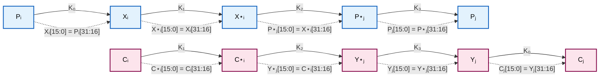
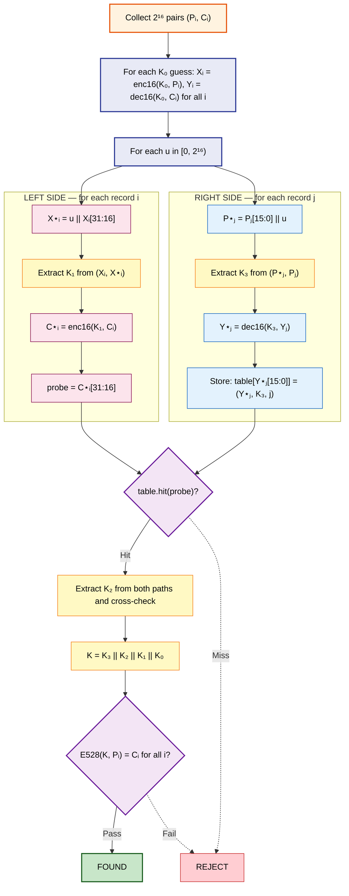
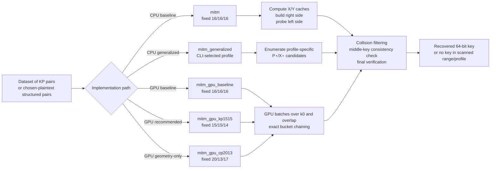
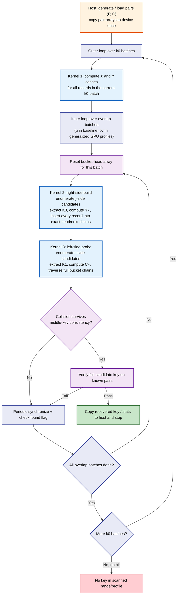

# Slide + Meet in the Middle Attack on KeeLoq

**Reference:** Indesteege, Keller, Dunkelman, Biham, Preneel. *"A Practical Attack on KeeLoq"*, EUROCRYPT 2008, LNCS 4965, pp. 1-18.
DOI: [10.1007/978-3-540-78967-3_1](https://doi.org/10.1007/978-3-540-78967-3_1)

This folder contains the repository implementations of the slide plus meet in the middle attack on full 528 round KeeLoq.

## Read This First

This README has three goals:

1. Explain the attack idea in simple steps.
2. Show what each program in this folder does.
3. Give tested commands and measured runtime results.

If you only want to run code, start with Quick Start. Then return to the theory sections when needed.

---

## Quick Start

### Recommended GPU path

```bash
make gpu-kp1515 CUDA_ARCH=sm_90 KP1515_OV_BATCH=1
./mitm_gpu_kp1515 000000000000001F --pairs-log2 14 --inject-slid-pair --max-k0 32
```

For an H100 or H200, use the Hopper-specific build and bounded benchmark:

```bash
make gpu-hopper
make benchmark-hopper
```

### Cross check with the baseline profile

```bash
make gpu-baseline CUDA_ARCH=sm_90
./mitm_gpu_baseline 000000000000001F --pairs-log2 14 --inject-slid-pair --max-k0 32
```

### CPU generalized reference

```bash
make generalized
./mitm_generalized --tp 15 --tc 15 --key 000000000000001F --pairs-log2 8 --max-k0 32 --inject-slid-pair
```

This is the generalized CPU path. It exposes the paper parameters directly, including the chosen plaintext reduction controls `--chosen`, `--cp-mask`, and `--cp-value`. The GPU programs remain profile specific by design.

### Random small-key regression

```bash
bash random_small_key_recovery.sh --cpu-only --baseline-trials 1 --kp1515-trials 1 --cp2013-trials 1 --max-k0 16 --pairs-log2 8
```

This validates the CPU reference on three small deterministic recovery cases. For GPU validation, run the same script without `--cpu-only`, or use `--gpu-only` on a CUDA machine.

---

## The Cipher

KeeLoq uses a 64-bit key, a 32-bit block, and 528 encryption rounds. Each round uses one bit of the key. Because the key is 64 bits and the key schedule repeats every 64 rounds, the full cipher is:

$$
E_{528} = E_{16} \circ (E_{64})^8
$$


That repetition is the structural weakness the attack exploits.

---

## Slid Pairs and Why We Need $2^{16}$ Plaintexts

The input data are known plaintext ciphertext records $(P_i, C_i)$ with $C_i = E_K(P_i)$. The attack looks for a **slid pair**: two records $(P_i, C_i)$ and $(P_j, C_j)$ from the dataset such that

$$
P_j = E_{64}(K, P_i).
$$

When such a pair exists, the repeating structure of the cipher lets us split the full 528 round encryption into manageable pieces.

**Why $2^{16}$ records?** We need at least one slid pair in the data. Consider any ordered pair $(P_i, P_j)$ with $i \neq j$. For it to be a slid pair, $P_j$ must equal the specific 32 bit value $E_{64}(K, P_i)$. Since $P_j$ is drawn uniformly from $\{0,1\}^{32}$, this happens with probability $2^{-32}$. With $N$ plaintexts there are $N(N-1)$ ordered pairs, so the number of slid pairs follows a $\text{Binomial}(N(N-1),\, 2^{-32})$ distribution with expected value

$$
\mu = \frac{N(N-1)}{2^{32}} \approx \frac{N^2}{2^{32}}.
$$

For small $\mu$, Binomial($n$, $p$) is well approximated by Poisson($\mu$), so

$$
\Pr[\text{at least one slid pair}] \approx 1 - e^{-\mu}.
$$

Setting $\mu = 1$ gives $N \approx 2^{16}$, at which point $\Pr \approx 1 - e^{-1} \approx 0.63$.

---

## How the Attack Works

### Phase 1: Collect Data

The attacker queries the target device with about $2^{16}$ chosen or known plaintexts and records the corresponding ciphertexts, building a dataset of pairs

$$
\mathcal{D} = \{(P_0, C_0),\, (P_1, C_1),\, \ldots,\, (P_{N-1}, C_{N-1})\}, \quad C_i = E_{528}(K, P_i).
$$

As shown in the previous section, with $N = 2^{16}$ the dataset contains at least one slid pair with probability about 0.63.

### Phase 2: Form Candidate Slid Pairs

A slid pair is an **ordered** pair of records $(P_i, C_i)$ and $(P_j, C_j)$ satisfying $P_j = E_{64}(K, P_i)$. Order matters: $(P_i, P_j)$ and $(P_j, P_i)$ are distinct candidates because the slid pair condition is directional. The attacker does not know the key, so the genuine ordered pair is unknown. The implementation reflects this directly: it builds a right side table by iterating over all $N$ records as candidates for index $j$, then probes that table by iterating independently over all $N$ records as candidates for index $i$. This covers all $N^2$ ordered pairs. Each ordered pair is assumed to be the genuine slid pair; a false pair fails the final verification and is discarded.

### Phase 3: Peel Rounds from Both Ends (Key Recovery)

Each candidate pair goes through the key split and round peeling steps below. Until final verification, we **assume the current pair $(P_i, C_i)$ and $(P_j, C_j)$ is a genuine slid pair**.

The 64-bit key is split into four chunks of **16 bits each**. Following the paper's notation, $K_0$ is the least significant chunk and $K_3$ is the most significant:

$$
K = K_3 \| K_2 \| K_1 \| K_0
\qquad
\begin{cases}
K_0 = k[0..15]   & \text{(least significant, guessed first)} \\
K_1 = k[16..31]  \\
K_2 = k[32..47]  \\
K_3 = k[48..63]  & \text{(most significant)}
\end{cases}
$$

Each record in the dataset is a full 528 round encryption: $C_i = E_{528}(K,\, P_i)$. Because $E_{528} = E_{16} \circ (E_{64})^8$, the first 16 rounds use $K_0$. The last 16 rounds also use $K_0$ because rounds 512 to 527 access key positions $(512..527) \bmod 64 = 0..15$. So once we guess $K_0$, we can peel the outer layers from both ends.

#### The NLFSR Passthrough Property

One KeeLoq round is $s' = (s \gg 1) \mid (\mathit{fb} \ll 31)$: the state shifts right by one bit and a new feedback bit $\mathit{fb}$ is injected at the top. After $t \leq 32$ forward rounds from state $A$ to state $B$:

$$
B[31:32{-}t] = \text{new feedback bits (key dependent)}, \qquad B[31{-}t:0] = A[31:t] \quad \text{(passthrough, free)}.
$$

Decryption reverses the shift, so after $t \leq 32$ backward rounds from state $A$ to state $B$:

$$
B[31:t] = A[31{-}t:0] \quad \text{(passthrough, free)}, \qquad B[t{-}1:0] = \text{new reverse feedback bits (key dependent)}.
$$

For $t = 16$, the **low** 16 bits of a forward encrypted state, $B[15:0] = A[31:16]$, and the **high** 16 bits of a backward decrypted state, $B[31:16] = A[15:0]$, are passthrough copies. No key bits are needed to compute them. The other 16 bits are new feedback bits and do depend on the key.

Now assume the current ordered pair is a genuine slid pair, so

$$
P_j = E_{64}(K, P_i).
$$

Applying the same 64 round step to the ciphertext side gives

$$
C_j = E_{64}(K, C_i).
$$

So the attack can work with two aligned 64 round rows: one from $P_i$ to $P_j$, and one from $C_i$ to $C_j$.

#### Symbol Guide

To make the notation easier to follow, read the symbols below as plain names:

| Symbol        | Read as  | Meaning                                                     |
| ------------- | -------- | ----------------------------------------------------------- |
| $P_i$       | P i      | plaintext record $i$                                      |
| $C_i$       | C i      | ciphertext record $i$                                     |
| $P_j$       | P j      | plaintext paired with $P_i$ by one 64 round step          |
| $C_j$       | C j      | ciphertext paired with $C_i$ by the same 64 round step    |
| $X_i$       | X i      | $P_i$ after the first 16 forward rounds                   |
| $Y_i$       | Y i      | $C_i$ after the last 16 rounds are removed                |
| $X^\star_i$ | X star i | $X_i$ after 16 more forward rounds                        |
| $P^\star_j$ | P star j | $P_j$ after 16 backward rounds                            |
| $C^\star_i$ | C star i | $C_i$ after 16 forward rounds with $K_1$                |
| $Y^\star_j$ | Y star j | $Y_j$ after 16 backward rounds with $K_3$               |

#### State Layout

Blue nodes are plaintext-side states; pink nodes are ciphertext-side states. Solid arrows show the key used; dashed arrows show the passthrough bit equality for that transition.



#### Peeling Steps

The steps below first show the basic fixed profile $(t_p, t_c, t_o) = (16, 16, 16)$ (`mitm.c`), then the generalized form (`mitm_generalized`).

**Baseline pseudocode (16,16,16).**

```
// N = number of dataset records (Pᵢ, Cᵢ), baseline N = 2^16
// Bit widths (baseline):
//   state words P,C,X,Y,P⋆,X⋆,Y⋆,C⋆,probe = 32 bits
//   key chunks K₀,K₁,K₂,K₃,u = 16 bits
//   full key K = 64 bits
//   indices i,j = ceil(log2 N) bits (16 bits when N = 2^16)

allocate X_cache[0..N-1], Y_cache[0..N-1]        // created once, reused across all K₀

for each K₀ candidate:                             // 2^16 iterations
    // K₀-scope scalars (created at loop entry): K₀:16, i:log2N, j:log2N, u:16
    for each record i:
        Xᵢ = enc16(K₀, Pᵢ)
        Yᵢ = dec16(K₀, Cᵢ)
        X_cache[i] = Xᵢ
        Y_cache[i] = Yᵢ

    for each u in [0, 2^16):                       // overlap guess
        table = new_hash_table()                   // created here (u-scope), discarded after this u

        // --- right side: build hash table over all j ---
        for each record j:                          // N records
            // j-scope temporaries: P⋆ⱼ:32, K₃:16, Y⋆ⱼ:32
            P⋆ⱼ = Pⱼ[15:0] || u
            K₃  = linear_extract(P⋆ⱼ, Pⱼ, 48, 16)
            Y⋆ⱼ = dec16(K₃, Y_cache[j])
            // table key width = 16 bits, payload stores enough to reconstruct the candidate later
            table.store(key=Y⋆ⱼ[15:0], value=(Y⋆ⱼ, K₃, j))

        // --- left side: probe for all i ---
        for each record i:                          // N records
            // i-scope temporaries: X⋆ᵢ:32, K₁:16, C⋆ᵢ:32, probe:16
            Xᵢ = X_cache[i]
            X⋆ᵢ = u || Xᵢ[31:16]
            K₁  = linear_extract(Xᵢ, X⋆ᵢ, 16, 16)
            C⋆ᵢ = enc16(K₁, Cᵢ)

            probe = C⋆ᵢ[31:16]
            for each hit in table.lookup(key=probe): // iterate hits in-place (no extra hit buffer)
                // hit-scope temporaries: K₂:16, K:64
                (Y⋆ⱼ, K₃, j) = hit.value
                P⋆ⱼ = Pⱼ[15:0] || u               // recovered from current j and current u
                K₂a = linear_extract(C⋆ᵢ, Y⋆ⱼ, 32, 16)
                K₂b = linear_extract(X⋆ᵢ, P⋆ⱼ, 32, 16)
                if K₂a != K₂b: continue
                K₂ = K₂a
                K  = K₃ || K₂ || K₁ || K₀
                if verify(K, dataset):
                    return K                        // FOUND
```

**Step 1 — Outer loop: guess $K_0$ ($2^{16}$ values).**
For each guess, compute for all $N$ records:

$$
X_i = \mathrm{enc}_{16}(K_0, P_i), \qquad Y_i = \mathrm{dec}_{16}(K_0, C_i).
$$

The implementation stores these in two cached arrays, `X_cache[i]` and `Y_cache[i]`, and reuses them across all $2^{t_o}$ overlap guesses for the same $K_0$.

**Step 2 — Inner loop: guess $u = P^\star_j[15:0]$ ($2^{16}$ values).**
The backward passthrough fixes the upper half of $P^\star_j$ for free: $P^\star_j[31:16] = P_j[15:0]$. The guess $u$ supplies the lower half, so the full state is known:

$$
P^\star_j = (P_j[15:0] \ll 16) \mid u.
$$

Now both endpoints of the transition $P^\star_j \xrightarrow{K_3, 16} P_j$ are known. **Linear key extraction** recovers the 16 key bits one round at a time. In round $r$, the passthrough places the feedback bit $\mathit{fb}_r$ at a known position of $P_j$, and the running state is fully known from $P^\star_j$. So solving $k[48+r] = \mathit{fb}_r \oplus \mathrm{NLF}(s_r) \oplus s_r[16] \oplus s_r[0]$ is just one XOR. Repeating this for 16 rounds gives $K_3 = k[48..63]$. The same idea is used for $K_1$ and $K_2$. Then compute $Y^\star_j = \mathrm{dec}_{16}(K_3, Y_j)$ and store it in a hash table keyed by $Y^\star_j[15:0]$.

**Step 3 — Left-side construction and extract $K_1$.**
The 16-round middle transition is $X^\star_i \xrightarrow{K_2,16} P^\star_j$. For any true candidate pair, passthrough over these 16 rounds gives

$$
P^\star_j[15:0] = X^\star_i[31:16].
$$

Since the current guess is $u = P^\star_j[15:0]$, we must have $X^\star_i[31:16] = u$. The forward passthrough on $X_i \xrightarrow{K_1,16} X^\star_i$ also gives $X^\star_i[15:0] = X_i[31:16]$. Together these fix the full state

$$
X^\star_i = u \parallel X_i[31:16].
$$

So for each record $i$, build $X^\star_i$ from $u$ and $X_i$, extract $K_1 = k[16..31]$ from the pair $(X_i, X^\star_i)$, compute $C^\star_i = \mathrm{enc}_{16}(K_1, C_i)$, and probe the table with $C^\star_i[31:16]$.

**Step 4 — Collision: extract $K_2$ and verify.**
A hit means $C^\star_i[31:16] = Y^\star_j[15:0]$. The baseline implementation then extracts the middle 16 key bits in **two** ways:

$$
K_2^{(C)} = \text{extract from } (C^\star_i, Y^\star_j),
\qquad
K_2^{(P)} = \text{extract from } (X^\star_i, P^\star_j).
$$

Only if these two values agree do we assemble

$$
K = K_3 \parallel K_2 \parallel K_1 \parallel K_0
$$

and verify the candidate key against known pairs. This cross-check removes many false positives before final verification.

**Generalized pseudocode ($(t_p, t_c, t_o)$).**

For generalized profiles, the right-side final key fragment is always the last `t_c` key bits. So the extraction and decryption window starts at $64 - t_c$ instead of the baseline-specific constant 48.

```
// Parameters:
//   tp = plaintext-side peeled rounds
//   tc = ciphertext-side peeled rounds
//   to = tp + tc - 16   (overlap bits)
//   k3_start = 64 - tc
//   N  = number of dataset records
// Bit widths (generalized):
//   state words P,C,X,Y,P⋆,X⋆,Y⋆,C⋆,probe = 32 bits
//   key chunks K₀ = 16 bits, K₁ = tp bits, Kmid = 48-tp-tc bits, K₃ = tc bits
//   overlap ov = to bits, full key K = 64 bits
//   indices i,j = ceil(log2 N) bits

allocate X_cache[0..N-1], Y_cache[0..N-1]        // created once, reused across all K₀
allocate Pstar_candidates[0..2^max(tc-to,0)-1]   // local candidate buffer for states consistent with ov
allocate Xstar_candidates[0..2^max(tp-to,0)-1]   // local candidate buffer for states consistent with ov

for each K₀ candidate:
    // K₀-scope scalars (created at loop entry): K₀:16, i:log2N, j:log2N, ov:to
    for each record i:
        Xᵢ = enc16(K₀, Pᵢ)
        Yᵢ = dec16(K₀, Cᵢ)
        X_cache[i] = Xᵢ
        Y_cache[i] = Yᵢ

    for each ov in [0, 2^to):
        table = new_hash_table()                   // created here (ov-scope), discarded after this ov

        for each record j:
            // j-scope temporaries: np:log2(2^(tc-to)), P⋆ⱼ:32, K₃:tc, Y⋆ⱼ:32
            np = build_pstar_candidates(Pⱼ, ov, tc, to, Pstar_candidates)

            for each P⋆ⱼ in Pstar_candidates[0..np-1]:
                K₃  = linear_extract(P⋆ⱼ, Pⱼ, k3_start, tc)
                Y⋆ⱼ = dec_tc(K₃, Y_cache[j], start=k3_start)
                // table key width = to bits, payload stores enough to reconstruct the candidate later
                table.store(key=Y⋆ⱼ[to-1:0], value=(P⋆ⱼ, Y⋆ⱼ, K₃, j))

        for each record i:
            // i-scope temporaries: nx:log2(2^(tp-to)), X⋆ᵢ:32, K₁:tp, C⋆ᵢ:32, probe:to
            Xᵢ = X_cache[i]
            nx = build_xstar_candidates(Xᵢ, ov, tp, to, Xstar_candidates)

            for each X⋆ᵢ in Xstar_candidates[0..nx-1]:
                K₁  = linear_extract(Xᵢ, X⋆ᵢ, 16, tp)
                C⋆ᵢ = enc_tp(K₁, Cᵢ)

                probe = C⋆ᵢ[31:32-to]
                for each hit in table.lookup(key=probe): // iterate hits in-place (no extra hit buffer)
                    // hit-scope temporaries: Kmid:(48-tp-tc), K:64
                    (P⋆ⱼ, Y⋆ⱼ, K₃, j) = hit.value
                    Kmid_from_C = linear_extract(C⋆ᵢ, Y⋆ⱼ, 16+tp, 48-tp-tc)
                    Kmid_from_P = linear_extract(X⋆ᵢ, P⋆ⱼ, 16+tp, 48-tp-tc)
                    if Kmid_from_C != Kmid_from_P: continue
                    K  = K₃ || Kmid_from_C || K₁ || K₀
                    if verify(K, dataset):
                        return K                        // FOUND
```

**Complexity from the pseudocode loop counts.**

Reading the nested loops directly:

| Loop level       | Iterations                | Work per iteration                                                      | Total round-ops                                 |
| ---------------- | ------------------------- | ----------------------------------------------------------------------- | ----------------------------------------------- |
| $K_0$ outer    | $2^{16}$                | Step 1:$2 \times 2^{16}$ records $\times$ 16 rounds each            | $2^{37}$                                      |
| $K_0$ + $ov$ | $2^{16} \times 2^{t_o}$ | Right side:$2^{16}$ records $\times$ $t_c$ rounds (dec + extract) | $2^{16} \cdot 2^{t_o} \cdot 2^{16} \cdot t_c$ |
| $K_0$ + $ov$ | $2^{16} \times 2^{t_o}$ | Left side:$2^{16}$ records $\times$ $t_p$ rounds (enc + extract)  | $2^{16} \cdot 2^{t_o} \cdot 2^{16} \cdot t_p$ |

Step 1 ($2^{37}$ rounds) is negligible. The dominant terms are the right- and left-side inner bodies. For the **baseline** profile $t_p = t_c = t_o = 16$:

$$
\underbrace{2^{16}}_\text{K₀} \times \underbrace{2^{16}}_{ov} \times \underbrace{2^{16}}_\text{records} \times (t_c + t_p)
= 2^{48} \times 32
= 2^{53} \text{ single-round operations}.
$$

Converting to full KeeLoq units (528 rounds $\approx 2^{9.0}$ rounds):

$$
\frac{2^{53}}{528} \approx \frac{2^{53}}{2^{9.0}} = 2^{44.0} \text{ KeeLoq-equivalent encryptions}.
$$

This raw loop count is intentionally implementation oriented. It counts the dominant partial encryption and decryption work, but it omits the paper's explicit collision-verification term. In Sect. 3.3 the paper models the baseline cost as

$$
2^{16} \left( 32 \cdot 2^{16} + 2^{16} \left( 32 \cdot 2^{16} + 2^{16} (32 + N_{\text{coll}} \cdot V) \right) \right),
$$

with $N_{\text{coll}} = 1$ and average verification cost $V \approx 4$. This gives about $2^{54.0}$ KeeLoq rounds, or about $2^{45.0}$ full KeeLoq encryptions, which is the figure quoted in the paper.

For the **generalized** implementation, the overlap guess fixes only `to` bits. The remaining `tc-to` low bits of $P^\star_j$ and `tp-to` high bits of $X^\star_i$ are enumerated explicitly by `build_pstar_candidates()` and `build_xstar_candidates()`. Sect. 3.4 of the paper gives the corresponding general expression

$$
2^{16} \left( 32 \cdot 2^{16} + 2^{t_o} \left( 2t_c \cdot 2^{16+t_c-t_o} + 2^{16+t_p-t_o}(2t_p + N_{\text{coll}} \cdot V) \right) \right),
$$

which simplifies there to an optimum at $(t_p, t_c, t_o) = (15,15,14)$ with time about $2^{44.5}$ full KeeLoq encryptions. Our generalized code follows the same geometry, but expresses it operationally by explicitly enumerating the admissible $P^\star_j$ and $X^\star_i$ candidates. At that implementation level the dominant inner work scales as

$$
2^{16} \cdot 2^{t_o} \cdot N \cdot \big(2^{t_c-t_o} \cdot t_c + 2^{t_p-t_o} \cdot t_p\big),
$$

before adding hash-table overhead, collision testing, and final verification. The repository profiles `(15,15,14)` and `(20,13,17)` match the paper's Sect. 3.4 and Sect. 3.5 geometries, while the exact wall-clock cost depends on these extra enumeration and verification terms. Note however that `mitm_gpu_cp2013` implements the fixed `(20,13,17)` geometry only; unlike the paper's chosen-plaintext attack, it does not enforce a chosen-plaintext structure or reduce the overlap-guess space from $2^{17}$ to $2^{13}$.

**Memory from the pseudocode data structures.**

For each fixed $K_0$, the pseudocode keeps:

- Cache arrays: `X_cache[0..N-1]` and `Y_cache[0..N-1]` (storing $X_i$ and $Y_i$), each one 32-bit word per record.
- Per-overlap hash table: created inside each `u`/`ov` iteration (one live table at a time), up to $N$ entries in baseline and up to $N \cdot 2^{t_c-t_o}$ entries in generalized. Each generalized entry stores enough data for the later cross-check, e.g. `(P⋆ⱼ, Y⋆ⱼ, K₃, j)`.
- Generalized only: `Pstar_candidates`, a temporary buffer of up to $2^{t_c-t_o}$ candidate 32-bit states for the current record, and `Xstar_candidates`, a temporary buffer of up to $2^{t_p-t_o}$ candidate 32-bit states.
- Scalar/scratch state: one copy of loop indices, overlap guess, temporary states, probe, key fragments, assembled key (explicit widths listed in each pseudocode block), totaling $O(1)$ words.

So the working memory is

$$
M_{\text{baseline}} = O(N),
\qquad
M_{\text{generalized}} = O\!\left(N \cdot 2^{t_c-t_o}\right) + O\!\left(2^{t_c-t_o} + 2^{t_p-t_o}\right),
$$

where the second term is the temporary candidate storage and the dominant generalized term comes from the enlarged per-overlap right-side table.

For comparison with the paper: Sect. 3.3 counts a much more compact **theoretical** baseline table — $2^{16}$ records of 80 bits each — together with the KP pairs and the cached $X_i, Y_i$, giving a total of a little over 2 MB. Our implementation keeps a richer payload per entry (to simplify later reconstruction and cross-checking), so its actual in-memory layout is somewhat larger than the paper's minimal estimate even though it follows the same attack logic.

Correctness note: the maintained CPU and GPU implementations store **all** right-side candidates for a bucket by using exact head/next chains over the record array; they do not cap each bucket to a fixed number of slots. This avoids the silent false negatives that a bounded per-bucket layout would introduce.

This repository implements all three profiles from the paper:

| Implementation                                     | Profile$(t_p, t_c, t_o)$ | Time              | Paper     |
| -------------------------------------------------- | -------------------------- | ----------------- | --------- |
| `mitm.c`, `mitm_gpu_baseline`                  | `(16, 16, 16)`           | about$2^{45.0}$ | Sect. 3.3 |
| `mitm_generalized`, `mitm_gpu_kp1515`          | `(15, 15, 14)`           | about$2^{44.5}$ | Sect. 3.4 |
| `mitm_generalized --chosen`                    | `(20, 13, 17)`           | about$2^{44.5}$ | Sect. 3.5 |
| `mitm_gpu_cp2013`                              | `(20, 13, 17)`           | geometry only    | Sect. 3.5 geometry |

---

## Attack Workflow

The diagram below shows the basic $(t_p, t_c, t_o) = (16, 16, 16)$ profile for clarity. Solid arrows show the main flow; dashed arrows point to rejection.



---

## Complexity

| Metric                  | Value                                       |
| ----------------------- | ------------------------------------------- |
| Data                    | $2^{16}$ known plaintext/ciphertext pairs |
| Time (profile 16/16/16) | about$2^{45.0}$ encryptions               |
| Time (profile 15/15/14) | about$2^{44.5}$ encryptions               |
| Time (profile 20/13/17) | about$2^{44.5}$ encryptions               |

Design note: `mitm_generalized` is the CPU reference that accepts CLI profile parameters (`--tp`, `--tc`, with `to = tp + tc - 16` derived internally). The GPU binaries are intentionally profile-specific to keep kernels fast and benchmarking reproducible.

| Implementation        | Profile          | Notes                                                                                                                                             |
| --------------------- | ---------------- | ------------------------------------------------------------------------------------------------------------------------------------------------- |
| `mitm.c`            | `(16, 16, 16)` | CPU fixed-profile baseline, multithreaded, Sect. 3.3                                                                                              |
| `mitm_generalized`  | configurable     | CPU generalized CLI path (`--tp`, `--tc`; `to` derived); covers all three profiles; chosen plaintext via `--chosen` (Sect. 3.3, 3.4, 3.5) |
| `mitm_gpu_baseline` | `(16, 16, 16)` | GPU baseline, Sect. 3.3                                                                                                                           |
| `mitm_gpu_kp1515`   | `(15, 15, 14)` | GPU, recommended production path, Sect. 3.4                                                                                                       |
| `mitm_gpu_cp2013`   | `(20, 13, 17)` | GPU, fixed Sect. 3.5 geometry only; it does not enforce chosen-plaintext structure and does not expose free `cp_mask`/`cp_value` like `mitm_generalized --chosen` |

### Repository Execution Paths



---

## Repository Status

- Main GPU path for practical runs: `mitm_gpu_kp1515`
- Main CPU reference path: `mitm_generalized`
- GPU check status: `mitm_gpu_baseline`, `mitm_gpu_kp1515`, and `mitm_gpu_cp2013` all recover known test keys in bounded runs with `--pairs-log2`, `--max-k0`, and `--inject-slid-pair`. The random bounded regression passes `18/18` trials across the three profiles (2 baseline, 10 kp1515, 6 cp2013) in 32 s at `--pairs-log2 8 --max-k0 64`.
- Throughput status: measured on an NVIDIA RTX PRO 6000 Blackwell Workstation Edition (`sm_120`), each profile over 64 low-key values at `--pairs-log2 16`. See the table below.
- Extra regression status: bounded random key tests pass for CPU profiles `(16,16,16)`, `(15,15,14)`, and `(20,13,17)` via `mitm_generalized`, and for all three GPU profiles via `random_small_key_recovery.sh`.
- Confidence note: results are strongly tested by experiments and cross checks, but this is still engineering evidence, not a full proof.

---

## Implementations in This Folder

| File                     | Role                                                                 |
| ------------------------ | -------------------------------------------------------------------- |
| `mitm.c`               | Original CPU multithreaded implementation                            |
| `mitm_generalized.c`   | CPU reference with parameterized overlap profile `(t_p, t_c, t_o)` |
| `mitm_generalized.h`   | Shared helpers and profile declarations                              |
| `mitm_gpu_baseline.cu` | GPU baseline, fixed profile `(16,16,16)`                           |
| `mitm_gpu_kp1515.cu`   | GPU implementation, fixed profile `(15,15,14)`, recommended path   |
| `mitm_gpu_cp2013.cu`   | GPU candidate, fixed `(20,13,17)` geometry from the chosen-plaintext section |
| `random_small_key_recovery.sh` | bounded randomized regression runner for small-key recovery checks |
| `Makefile`             | Build and cleanup targets                                            |

---

## Regression Benchmarks

Measured local CPU run (macOS, March 2026):

| Profile | Result | Wall time |
|---|---|---|
| baseline `(16,16,16)` | pass | 26.73 s |
| kp1515 `(15,15,14)` | pass | 8.60 s |
| cp2013 `(20,13,17)` | pass | 398.89 s |

Aggregate timing for the above 3-trial bundle:

- `real 435.06`
- `user 432.79`
- `sys 0.95`

Interpretation:

- All three CPU profiles recovered the expected full 64 bit key in bounded deterministic tests.
- The cp2013 geometry needs much more time than baseline and kp1515 in this CPU test setup.

Example GPU-server regression command for the recommended profile:

```bash
make clean && make gpu-kp1515 CUDA_ARCH=sm_120 KP1515_OV_BATCH=1 GPU_STATS=0 && time -p bash random_small_key_recovery.sh --gpu-only --no-build --pairs-log2 11 --max-k0 15361 --baseline-trials 0 --kp1515-trials 10 --cp2013-trials 0
```

Measured result on an NVIDIA RTX PRO 6000 Blackwell Workstation Edition (`sm_120`), with
`--gpu-only --pairs-log2 8 --max-k0 64`:

- 18/18 random bounded recoveries passed across all three GPU profiles
  (2 baseline, 10 kp1515, 6 cp2013)
- total wall time: 32 s
- per-trial wall time: 0.09-0.47 s for kp1515, 0.63-0.69 s for baseline, 1.36-5.88 s for cp2013

This is a bounded regression run. It checks correctness and speed trends; it is not the same as a
full attack run over all key chunks. Trial times vary widely because each trial stops as soon as
its randomly chosen `k0` is reached.

For a throughput sample rather than a correctness check, run a fixed bounded workload whose key
lies outside the scanned range so the full budget is executed:

```bash
time ./mitm_gpu_kp1515 000000000000FFFF --pairs-log2 16 --max-k0 64
```

Record the GPU and toolchain alongside any reported number:

```bash
nvidia-smi --query-gpu=name,compute_cap,driver_version,memory.total,power.limit --format=csv,noheader
nvcc --version | tail -n 1
```

---

## Build Targets

### CPU builds

```bash
make build
make generalized
```

### GPU builds

```bash
make gpu CUDA_ARCH=sm_90
make gpu-baseline CUDA_ARCH=sm_90
make gpu-kp1515 CUDA_ARCH=sm_90
make gpu-cp2013 CUDA_ARCH=sm_90
make gpu-hopper
```

`make gpu` is an alias of the recommended `make gpu-kp1515` path.
`make gpu-hopper` builds all three profiles for `sm_90`, shared by H100 and H200,
with a memory-efficient batch geometry measured on H100. `make gpu-h200` remains
a compatibility alias. Other GPUs use the ordinary targets with an explicit
`CUDA_ARCH`, such as `make gpu-kp1515 CUDA_ARCH=sm_89`.

If `nvcc` is missing, GPU build targets fail early with a clear message.

### Randomized regression builds

The regression runner forces rebuilds with `make -B` so that stale binaries copied from another machine or architecture do not invalidate the results.

---

## Running the CPU Variants

### Original CPU attack

```bash
make build
./mitm 8
./mitm 256 5CEC6701B79FD949
```

### Generalized CPU reference

```bash
make generalized
./mitm_generalized --tp 16 --tc 16 --key 5CEC6701B79FD949
./mitm_generalized --tp 15 --tc 15 --max-k0 4096
./mitm_generalized --tp 20 --tc 13 --chosen --cp-mask 0000FFFF --cp-value 00001234
```

These run the Sect. 3.3, Sect. 3.4, and Sect. 3.5 profiles respectively.

### Fast correctness mode

```bash
./mitm_generalized --tp 16 --tc 16 --pairs-log2 8 --inject-slid-pair --max-k0 32 --key 0000000000000005
```

`--max-k0` must cover the true low 16 key bits. For example, key suffix `...D949` requires `--max-k0 >= 55626`.

### Chosen plaintext reduction example

```bash
./mitm_generalized --tp 20 --tc 13 --chosen --cp-mask 0000000F --cp-value 00000005 --pairs-log2 8 --max-k0 32
```

---

## Running the GPU Variants

### Baseline GPU profile `(16,16,16)`

```bash
make gpu-baseline CUDA_ARCH=sm_90
./mitm_gpu_baseline 0000000000000005 --pairs-log2 8 --inject-slid-pair --max-k0 32
```

### Recommended GPU profile `(15,15,14)`

```bash
make gpu-kp1515 CUDA_ARCH=sm_90 KP1515_OV_BATCH=1
./mitm_gpu_kp1515 0000000000000005 --pairs-log2 8 --inject-slid-pair --max-k0 32
```

Each GPU binary also supports `--block-dim N` (multiple of 32 in `[64,1024]`) or auto-selects a launch block size using CUDA occupancy when omitted.
Batch geometry remains a build-time setting so benchmark binaries are reproducible.
Unsafe hash-index or VRAM configurations are rejected before allocation.

### H100/H200 benchmark

```bash
make clean
make gpu-hopper
make benchmark-hopper
```

The benchmark uses an injected slid pair and a bounded low-key space, then runs all
three GPU profiles. Record the complete program output together with:

```bash
nvidia-smi --query-gpu=name,uuid,driver_version,memory.total,power.limit --format=csv
nvcc --version
```

The default Hopper geometry is `K0_BATCH=64`, overlap batch `1`, found checks every
4096 overlap guesses, and GPU statistics disabled. The small `64 x 1` batch geometry is
deliberate: enlarging it to `256 x 32` multiplies the hash-table allocation by roughly two orders
of magnitude for a wall-time difference around 1%, so the compact geometry is the better default.
At `2^16` pairs the kp1515 allocation is 140.5 MB. For a longer throughput sample, use, for
example:

```bash
make -B mitm_gpu_kp1515_hopper
time -p ./mitm_gpu_kp1515_hopper 0000000000000100 \
  --pairs-log2 16 --inject-slid-pair --max-k0 256
```

The key suffix `0x0100` lies just outside `[0,256)`, so this command deliberately
runs the complete bounded workload and reports no key.

### GPU candidate for the `(20,13,17)` geometry

```bash
make gpu-cp2013 CUDA_ARCH=sm_90
./mitm_gpu_cp2013 0000000000000005 --pairs-log2 8 --inject-slid-pair --max-k0 32
```

`mitm_gpu_cp2013` is a fixed GPU specialization of the `(20,13,17)` geometry. It does **not** expose arbitrary `cp_mask`/`cp_value` controls like `mitm_generalized --chosen`, and it does not implement the paper's chosen-plaintext reduction in overlap guesses.

### Randomized regression runner

```bash
bash random_small_key_recovery.sh --baseline-trials 1 --kp1515-trials 2 --cp2013-trials 1 --max-k0 16 --pairs-log2 8
```

Recommended use:

- Use `--inject-slid-pair` indirectly through the script's built-in test commands so each reduced test is deterministic.
- Keep `--max-k0` small (for example `16` or `64`) so the true low 16 key bits always lie in the scanned range while runtimes stay short.
- Use `--cpu-only` for the generalized reference, `--gpu-only` for CUDA-only smoke checks, or no mode flag to run both.
- Treat this as a regression/sanity suite, not as a measurement of full attack runtime.

---

## GPU Architecture Options

| GPU family    | `CUDA_ARCH` |
| ------------- | ------------- |
| Pascal        | `sm_60`     |
| Volta         | `sm_70`     |
| Turing        | `sm_75`     |
| Ampere        | `sm_80`     |
| Ada           | `sm_89`     |
| Hopper / H100 | `sm_90`     |
| Blackwell (data center) | `sm_100`    |
| Blackwell (RTX 50xx)    | `sm_120`    |

---

## GPU Parallelization Strategy

All fixed-profile GPU binaries keep the same cryptanalytic structure as the CPU code, but execute it in batches so that device memory stays bounded.

### GPU implementation workflow



Implementation notes:

- `mitm_gpu_baseline` batches over `k0` and the 16-bit overlap guess `u`.
- `mitm_gpu_kp1515` batches over `k0` and the 14-bit overlap `ov`; each `(j, ov)` and `(i, ov)` has multiplicity 2.
- `mitm_gpu_cp2013` batches over `k0` and the 17-bit overlap `ov`; the right side has at most one admissible `P⋆ⱼ` per `(j, ov)`, while the left side enumerates 8 `X⋆ᵢ` candidates.
- The maintained GPU code uses exact bucket chains (`head` / `next`) so every right-side candidate is retained; no per-bucket candidate truncation is allowed.
- The host checks the global `found` flag periodically between overlap batches to avoid synchronizing after every kernel launch.
- Hash records store the fixed-profile `K3` fragment in compact unshifted form, reducing each record from 16 to 12 bytes without changing candidate enumeration.
- Bucket resets use the active batch size and remain ordered with the kernels in the default CUDA stream.

---

## Tuning Notes

### Fixed GPU profiles

| Variable              | Default | Meaning                                         |
| --------------------- | ------: | ----------------------------------------------- |
| `KP1515_K0_BATCH`   |      64 | low-key batch size for kp1515 GPU profile       |
| `KP1515_OV_BATCH`   |       1 | overlap batch size for kp1515 GPU profile       |
| `KP1515_FOUND_CHECK_INTERVAL` | 1024 | overlap guesses between host flag checks |
| `GPU_STATS`         |       0 | compile-time toggle for GPU hot-path counters (`1` enables `Right/Left/Verify` counters) |

General guidance:

- Right-side bucket storage is exact; there is no fixed per-bucket slot cap in the maintained CPU/GPU code paths.
- Increase batch sizes only after checking memory headroom.
- The Hopper target uses the measured memory-efficient `64 x 1` geometry. On H100,
  `256 x 32` is within about 1% on wall time for the fixed workload while using roughly two
  orders of magnitude more memory.
- Use `--inject-slid-pair` for quick correctness checks.
- Use `random_small_key_recovery.sh` for repeatable bounded recovery regression across profiles.
- `mitm_gpu_cp2013` is a fixed profile specialization, not a complete chosen plaintext implementation.

---

## Expected Runtime

All three GPU profiles measured on an NVIDIA RTX PRO 6000 Blackwell Workstation Edition
(`sm_120`, 188 SMs), each over 64 low-key values at `--pairs-log2 16` with a key outside the
scanned range so the full budget runs:

| Profile | Bounded run (64 `k0`) | Per `k0` | Full `2^16` scan | Device memory |
| ------- | ---------------------: | -------: | ---------------: | ------------: |
| `mitm_gpu_baseline` (16,16,16) | 17.58 s | 0.275 s | about 5.0 h | 112.5 MB |
| `mitm_gpu_kp1515` (15,15,14) | 22.37 s | 0.349 s | about 6.4 h | 140.5 MB |
| `mitm_gpu_cp2013` (20,13,17) | 130.27 s | 2.036 s | about 37.1 h | 64.5 MB |

| Hardware         | Full-scan wall time | Notes                                    |
| ---------------- | ------------------- | ---------------------------------------- |
| RTX PRO 6000 Blackwell (`sm_120`) | 5.0 h to 6.4 h | best two profiles, extrapolated from bounded runs |
| Large CPU server | weeks               |                                          |

Per-`k0` cost is essentially uniform, so these extrapolations are stable, but they are still
extrapolations rather than completed full-scale runs.

**On profile choice.** The `(15,15,14)` profile has the lower nominal complexity
(about $2^{44.5}$ against $2^{45.0}$), yet the baseline `(16,16,16)` is faster in wall-clock here.
The reason is table geometry rather than arithmetic: the baseline stores $N = 2^{16}$ entries in
$2^{16}$ buckets, so its mean hash chain is one entry long, while `(15,15,14)` stores $2N = 2^{17}$
entries in $2^{14}$ buckets and walks about 8 entries per probe. Those extra chain steps are
dependent scattered memory reads, and on this hardware they cost more than the arithmetic the
smaller overlap saves. Nominal complexity and measured wall-clock disagree here, so pick the
profile by measurement on your own card.

Two things determine how long a real attack takes beyond this rate:

- Conditioned on a slid pair being present, the expected hit time for a uniformly random key is
  about half a full scan.
- A slid pair is present at all with probability about $1 - e^{-1} \approx 0.63$ for $N = 2^{16}$
  known pairs, so about $37\%$ of random datasets contain none and the scan completes without
  finding a key. That is the expected failure mode, not a bug: use `--inject-slid-pair` when you
  need a deterministic run.

Runtimes on other hardware are not listed because they have not been measured with the current
code. Measure your own card with the bounded command in the benchmark section rather than scaling
from these numbers.

---

## Cleanup

```bash
make clean
make clean-logs
make clean-all
```
